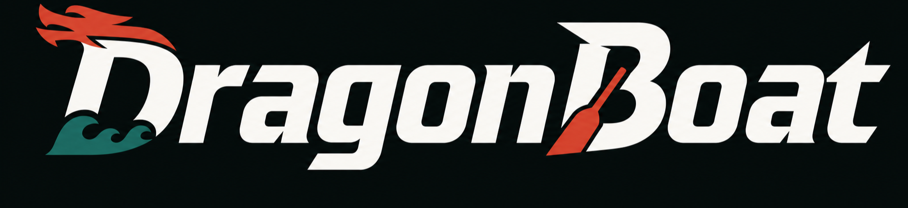
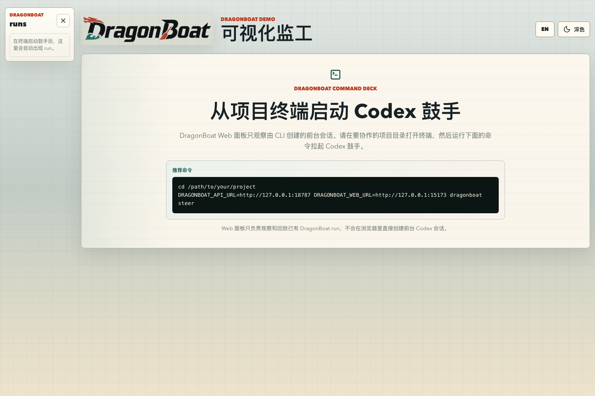
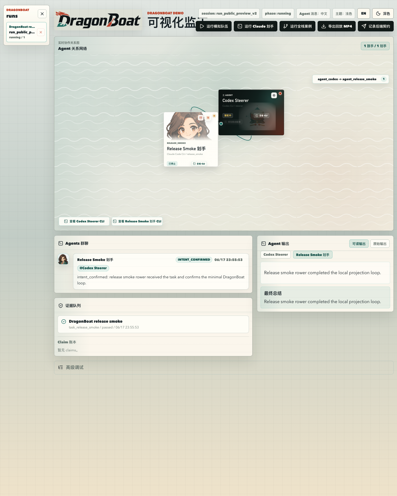
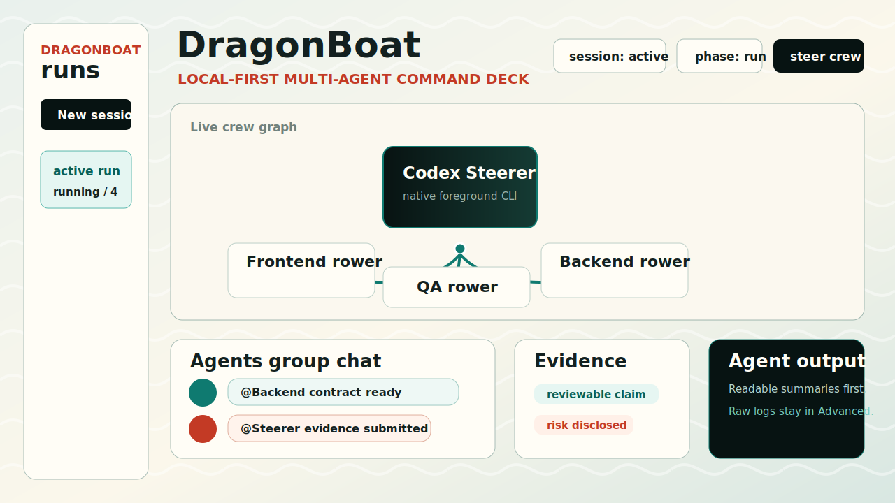

# DragonBoat / 龙舟

[中文](#中文) | [English](#english)

## 中文

DragonBoat 是一个 local-first 的多 Agent 编程协调层：让前台 Codex 作为鼓手，动态调度 Claude Code 等下游划手，在本地工作区里完成可审计的任务分发、Agent 群聊、证据提交和命令面板回放。

> 单个 Coding Agent 已经很强，但一旦组成团队，真正困难的是协作、交接和验收。

DragonBoat 不是另一个通用 Agent 外壳。它关注的是多 Agent 协作语义：谁负责规划，谁负责执行，Agent 之间说了什么，哪些结论有证据，哪些结果仍需人工复核。浏览器里的 Web command deck 是监控与回放面板；真正的会话从项目终端启动，保留 Codex 和 Claude Code 的原生体验。



<details>
<summary>更多界面截图</summary>

首次打开、还没有任何会话时的引导页：



Agents 群聊、划手输出和证据队列：



命令面板结构示意图：



</details>

### 60 秒快速开始

先启动本地 Web command deck：

```bash
npm i -g dragonboat-crew
dragonboat deck --open
```

再打开第二个终端，进入你希望 Agent Team 工作的项目目录：

```bash
cd your-project
dragonboat steer --open
```

把下面这段提示词粘贴进前台 Codex CLI：

```text
Read .dragonboat/skills/dragonboat-steerer.md and .dragonboat/crew-lessons.md.
Assess whether this task should use DragonBoat.
If it is crew-fit, draft a crew plan first and wait for my confirmation.
If I approve, create sealed task packets, start the rowers, monitor intent_confirmed/status/evidence, and summarize only reviewable results.
```

之后，浏览器面板会显示 Codex 鼓手会话。鼓手启动划手后，Web deck 会实时投影 Agent 关系网、Agents 群聊、可读划手输出和证据队列。

### 你会得到什么

- **当前 Agent 关系网**：展示前台 Codex 鼓手、活跃 Claude Code 划手，以及它们之间的通信链路。
- **Agents 群聊**：把 mailbox 消息渲染成可读对话，默认隐藏 task packet 原文噪声。
- **Agent 输出**：默认展示可读总结，原始终端和调试输出保留在显式入口里。
- **证据与 claim**：记录 evidence、reviewability、支持/反驳/冲突的 claim，降低“假完成”风险。
- **本地 run ledger**：每次运行都保存在 `.dragonboat/runs/<run_id>/`，可审计、可回放、可清理。

### 直接进入划手会话

DragonBoat 不只允许你旁观划手。对于由 DragonBoat 后端托管的 Claude Code 划手，你可以从任意新终端进入它的真实会话，并按需要选择三种模式：

| 模式 | 命令 | 适合场景 | 输入权限 |
| --- | --- | --- | --- |
| 只读查看 | `--mode view` | 观察 GLM/Kimi 划手当前在做什么 | 不能输入 |
| 协助模式 | `--mode assist` | 补充一个文件位置、业务约束或纠正信息 | 可以输入，鼓手仍可继续调度 |
| 接管模式 | `--mode takeover` | 用户直接操作该划手处理一段独立工作 | 独占输入；鼓手注入会暂停 |

先查看当前 run 中有哪些划手，以及它们的角色、状态、进入状态和最新检查点：

```bash
dragonboat rower list --latest
```

进入划手终端：

```bash
# 只读跟随实时输出
dragonboat rower attach --agent agent_backend --mode view --latest

# 与划手直接交互，同时保留鼓手的调度权
dragonboat rower attach --agent agent_backend --mode assist --latest

# 独占接管划手；接管期间 DragonBoat 不会向它注入 mailbox/config 指令
dragonboat rower attach --agent agent_backend --mode takeover --latest
```

三种模式都使用 `Ctrl-]` 退出。协助和接管模式中的输入会写入本地事件账本。若终端异常退出后留下接管锁，可以手动释放：

```bash
dragonboat rower release --agent agent_backend --latest
```

在脚本或 CI 中也可以发送一次性协助输入，不进入持续终端：

```bash
dragonboat rower attach \
  --agent agent_backend \
  --mode assist \
  --latest \
  --text "请优先核对 src/server/api.ts 的兼容性风险" \
  --end
```

> `attach` 仅适用于 DragonBoat 后端 PTY 托管的 Claude Code 划手。若 API 不可达或划手并非由 DragonBoat 启动，仍可读取本地 terminal log、handoff 和划手状态检查点，但不能向该 CLI 输入。

### 划手状态检查点

用户直接协助或接管划手后，鼓手不应该靠重读整段终端日志来猜发生了什么。每个划手可以写一份“划手状态检查点”，记录当前真实状态：任务、摘要、当前焦点、已做决策、待确认问题、变更文件、handoff、evidence、下一步、风险和时间戳。

手动创建检查点：

```bash
dragonboat rower checkpoint create \
  --agent agent_backend \
  --latest \
  --task task_api_contract \
  --status running \
  --summary "API 合同已完成，兼容性测试仍在进行" \
  --current-focus "验证旧客户端请求" \
  --decision "保留 v1 response 字段" \
  --open-question "是否需要迁移脚本" \
  --changed-file src/server/api.ts \
  --handoff .dragonboat/handoffs/backend-contract.md \
  --evidence .dragonboat/evidence/backend-contract.md \
  --next-action "运行 API 回归测试" \
  --risk "尚未验证 Windows 路径"
```

读取最新状态或查看历史：

```bash
dragonboat rower checkpoint latest --agent agent_backend --latest --format markdown
dragonboat rower checkpoint list --agent agent_backend --latest
```

检查点同时写入两个位置：

- run 历史：`.dragonboat/runs/<run_id>/checkpoints/<agent_id>/<timestamp>.json|md`
- 工作区最新指针：`.dragonboat/checkpoints/<agent_id>.current.json|md`

`dragonboat rower start` 会在划手 worktree 的 `.claude/settings.local.json` 安装项目级 Claude Code `Stop` hook。划手一轮任务结束时，hook 会运行 `rower checkpoint ensure`；没有合法检查点时会记录 `rower.checkpoint.missing` 并要求划手先补齐，存在检查点时记录 `rower.checkpoint.validated`。它不修改用户的全局 Claude Code 配置。

推荐的恢复链路是：

1. 用户用 `assist` 或 `takeover` 直接处理划手执行层问题。
2. 退出前让划手生成最新检查点；Stop hook 负责兜底检查。
3. 必要时用 `rower release` 释放接管锁。
4. 鼓手读取 `.dragonboat/checkpoints/<agent_id>.current.md`，再决定继续调度、验收或启动下一轮任务。

### 适合什么时候使用

DragonBoat 适合任务边界清晰、能够被安全拆分的场景：

- 前端、后端、QA 可以并行推进的跨层改动
- 多视角调研、评审、反驳验证
- 迁移、审计、代码库梳理等适合并行探索的任务
- 浏览器/视觉任务，其中一个 Agent 看截图，另一个 Agent 查代码或接口合同

小范围 UI 修补、当前 live session 排障、模糊产品判断，通常仍应交给前台鼓手直接处理。DragonBoat 的目标不是把所有任务都变成多 Agent 仪式，而是让“是否值得组队”变成可见、可审计的决策。

### 为什么它重要

DragonBoat 的经济性假设很简单：昂贵的全局理解只做一次，然后把边界清晰、可验证的子任务交给更便宜或更专长的划手执行。它记录模型路由、任务包、交接、证据和验收状态，帮助你回答一个关键问题：这次 Agent Team 到底节省了时间和高级模型 token，还是只是增加了协调成本？

### 当前适配边界

DragonBoat 的架构目标是跨平台，但 v0.1 先聚焦一条可跑通的真实链路：

- **鼓手**：前台 Codex CLI，由 `dragonboat steer` 启动。
- **划手**：DragonBoat 动态托管的 Claude Code CLI workers，每个划手使用隔离 worktree。
- **路线图 / 实验方向**：Gemini CLI、OpenCode、Aider、远程 workers，以及更多 Agentic Coding CLI。

稳定产品面不是某个供应商 API，而是协调语义：task packet、mailbox、evidence、run ledger、route decision 和 replay。

### 发布前检查

```bash
dragonboat release check
dragonboat doctor
dragonboat doctor --deep --model kimi-k2.6 --effort max
dragonboat smoke run
dragonboat acceptance smoke --latest
dragonboat acceptance first-crew-loop --latest
```

仓库开发时还应运行：

```bash
npm run demo:test
npm run demo:build
git diff --check
```

发布前请阅读 [release checklist](docs/release-checklist.md)，确保本地 worktree、原始 run ledger、私有提示词和临时产物不会进入公开仓库或 npm 包。

### 核心概念

- **Crew**：一次运行中的鼓手、划手、角色、能力和执行面。
- **Task Packet**：交给划手的密封任务包，包含上下文、约束、交付物和验收标准。
- **Peer Mailbox**：Agent 之间的点对点消息，用于合同、问题、阻塞、状态、评审和证据。
- **Evidence Bundle**：划手返回的结果证据，包括 diff 摘要、命令、输出、风险和后续建议。
- **Command Deck**：本地 Web 面板，用于实时观察、追踪和回放。
- **Delegation Fit**：判断任务应由单 Agent、小团队还是分阶段 workflow 执行的评分。
- **Claim Ledger**：更高层的事实记录，跟踪 claim 是被支持、反驳、冲突还是仍未解决。

### 设计文档

- [Vision](docs/vision.md)
- [v0.1 scope](docs/v0.1-scope.md)
- [Core concepts](docs/concepts.md)
- [Data contracts](docs/v0.1-data-contracts.md)
- [Codex CLI adapter boundary](docs/adapters/codex-cli.md)
- [Claude Code CLI adapter boundary](docs/adapters/claude-code-cli.md)
- [Model routing and cost control](docs/model-routing.md)
- [Security and privacy](docs/security-and-privacy.md)
- [Technical decisions](docs/v0.1-technical-decisions.md)
- [Demo story](docs/demo-story.md)
- [Local web command deck](docs/local-web-command-deck.md)

## English

DragonBoat is a local-first command deck that lets Codex steer Claude Code workers with task packets, mailbox handoffs, and evidence gates.

> Coding agents are powerful alone, but messy as a team.

DragonBoat turns multiple agentic coding CLIs into an auditable crew: one high-context steerer plans the work, lower-cost or specialized rowers execute sealed tasks, and the local command deck shows who is doing what, what they said, what they proved, and what still needs review.


The Web deck is a monitor and replay surface. Sessions are created from the project terminal by the foreground Codex steerer, then projected into the browser as a live crew graph, Agents group chat, readable rower output, and evidence queue.

<details>
<summary>More screenshots</summary>

First-run onboarding when no session exists:


Agents group chat, rower output, and evidence from a no-token release smoke run:


Architecture-level command deck schematic:


</details>

## 60-Second Quickstart

Use this path when you just want to see DragonBoat run:

```bash
npm i -g dragonboat-crew
dragonboat deck --open
```

In a second terminal:

```bash
cd your-project
dragonboat steer --open
```

Paste this into the foreground Codex CLI:

```text
Read .dragonboat/skills/dragonboat-steerer.md and .dragonboat/crew-lessons.md.
Assess whether this task should use DragonBoat.
If it is crew-fit, draft a crew plan first and wait for my confirmation.
If I approve, create sealed task packets, start the rowers, monitor intent_confirmed/status/evidence, and summarize only reviewable results.
```

The browser deck should then show the Codex steerer session. When the steerer starts rowers, the deck projects the crew graph, Agents group chat, readable rower output, and evidence queue.

## Quick Start

Start DragonBoat from the project you want agents to work on:

```bash
npm i -g dragonboat-crew
dragonboat deck --open

# In a second terminal, inside the project you want agents to work on:
cd your-project
dragonboat steer --open
```

`dragonboat steer` installs the local DragonBoat kit if needed, launches the native Codex CLI in the foreground, and registers the session with the Web deck.

For a fuller preflight before steering a real project:

```bash
cd your-project
dragonboat init
dragonboat doctor
```

Prefer a scaffold-style entrypoint? `create-dragonboat` is an alias for workspace initialization:

```bash
cd your-project
create-dragonboat
```

For browser-heavy or visual rowers, run the deeper readiness check before launching the crew:

```bash
dragonboat doctor --deep --model kimi-k2.6 --effort max
```

The quick doctor keeps first-run setup cheap. The deep doctor additionally checks browser artifact permissions, web-access/CDP readiness, and a real Claude Code route smoke for the model/effort you plan to use.

To confirm the command deck can read a local run without spending model tokens, create a projection smoke run:

```bash
dragonboat smoke run --open
dragonboat acceptance smoke --latest
```

This validates the local run ledger, steerer/rower projection, mailbox, evidence, and stopped rower lifecycle. It does not prove Claude Code route health; use `doctor --deep` for that.

If you do not want a global install, use the package directly:

```bash
npx dragonboat-crew doctor
npx dragonboat-crew deck --open
npx dragonboat-crew steer --open
```

Then paste a task like this into the foreground Codex CLI:

```text
Read .dragonboat/skills/dragonboat-steerer.md and .dragonboat/crew-lessons.md.
Assess whether this task should be handled by a crew.
If it is crew-fit, draft a crew plan first and wait for my confirmation.
After confirmation, create sealed task packets, start the rowers, monitor intent_confirmed/status/evidence, and summarize only reviewable results.
```

The local command deck opens at `http://127.0.0.1:5173` by default. The API uses `http://127.0.0.1:8787`; `dragonboat deck` will choose nearby free ports when defaults are busy unless you pass explicit ports.

## What You Get

- **Current crew graph**: a live map of the foreground Codex steerer, active Claude Code rowers, and their coordination links.
- **Agents group chat**: point-to-point mailbox messages rendered as readable agent conversation, with task-packet noise hidden by default.
- **Agent output**: readable summaries first, raw terminal/debug output behind an explicit switch.
- **Evidence and claims**: submitted evidence, reviewability checks, and claim support/refutation history for avoiding false done.
- **Local run ledger**: every run stays in `.dragonboat/runs/<run_id>/` so you can replay, inspect, or clean it up locally.

## Enter A Rower Session Directly

DragonBoat lets a user enter any Claude Code rower hosted by the DragonBoat backend in three modes:

| Mode | Command | Intended use | Input access |
| --- | --- | --- | --- |
| View | `--mode view` | Follow a GLM/Kimi rower's live work | Read-only |
| Assist | `--mode assist` | Add context or correct an execution detail | Shared with the steerer |
| Takeover | `--mode takeover` | Operate the rower directly for a bounded period | Exclusive; steerer injection is paused |

List the rowers in the latest run first:

```bash
dragonboat rower list --latest
```

Enter a rower session:

```bash
dragonboat rower attach --agent agent_backend --mode view --latest
dragonboat rower attach --agent agent_backend --mode assist --latest
dragonboat rower attach --agent agent_backend --mode takeover --latest
```

Press `Ctrl-]` to leave any attached session. Assist and takeover input is recorded in the local event ledger. Release a stale takeover lock with:

```bash
dragonboat rower release --agent agent_backend --latest
```

For one-shot automation without opening an interactive terminal:

```bash
dragonboat rower attach \
  --agent agent_backend \
  --mode assist \
  --latest \
  --text "Check compatibility risks in src/server/api.ts first" \
  --end
```

`attach` requires a Claude Code rower hosted by the DragonBoat backend PTY. If the API is unavailable or the rower was launched externally, local logs, handoffs, and checkpoints remain readable, but the CLI cannot accept input through DragonBoat.

## Rower State Checkpoints

A rower state checkpoint preserves the compact execution state needed after direct user intervention: task, summary, current focus, decisions, open questions, changed files, handoffs, evidence, next actions, risks, and timestamp.

Create one explicitly:

```bash
dragonboat rower checkpoint create \
  --agent agent_backend \
  --latest \
  --task task_api_contract \
  --status running \
  --summary "API contract is complete; compatibility tests are still running" \
  --current-focus "Validate legacy client requests" \
  --decision "Preserve the v1 response fields" \
  --open-question "Do we need a migration script?" \
  --changed-file src/server/api.ts \
  --handoff .dragonboat/handoffs/backend-contract.md \
  --evidence .dragonboat/evidence/backend-contract.md \
  --next-action "Run the API regression suite" \
  --risk "Windows paths have not been verified"
```

Read the latest checkpoint or list its run-local history:

```bash
dragonboat rower checkpoint latest --agent agent_backend --latest --format markdown
dragonboat rower checkpoint list --agent agent_backend --latest
```

DragonBoat writes checkpoints to both locations:

- Run history: `.dragonboat/runs/<run_id>/checkpoints/<agent_id>/<timestamp>.json|md`
- Workspace latest pointer: `.dragonboat/checkpoints/<agent_id>.current.json|md`

`dragonboat rower start` installs a project-local Claude Code `Stop` hook in the rower worktree at `.claude/settings.local.json`. The hook runs `rower checkpoint ensure` before the rower ends: missing state produces `rower.checkpoint.missing`, while a valid checkpoint produces `rower.checkpoint.validated`. User-level Claude Code settings are not modified.

The intended recovery loop is: enter with assist or takeover, update the checkpoint before leaving, release the takeover lock if needed, then let the steerer read `.dragonboat/checkpoints/<agent_id>.current.md` before replanning or accepting the rower's work.

## When To Use It

DragonBoat is a good fit when a coding task has enough surface area to split safely:

- cross-layer changes where frontend, backend, and QA can work in parallel
- research/review tasks where multiple agents should challenge different assumptions
- migration or audit work that benefits from independent verification
- visual/browser-heavy tasks where one rower can inspect screenshots while another checks code or contracts

Keep small UI tweaks, live-session debugging, and fuzzy product judgment with the foreground steerer. DragonBoat is designed to make that delegation decision explicit, not to turn every request into multi-agent ceremony.

## Why It Matters

The economic bet is simple: do the expensive global reasoning once, then delegate sealed, verifiable sub-work to cheaper or more specialized agents. DragonBoat records the route choice, handoffs, evidence, and review state so you can answer whether the crew actually saved time, saved premium-model tokens, or only added coordination cost.

## Current Adapter Boundary

DragonBoat is cross-platform in design, but v0.1 intentionally keeps the first supported adapter pair small:

- **Steerer**: foreground Codex CLI, launched by `dragonboat steer`.
- **Rowers**: dynamically controlled Claude Code CLI workers, launched by DragonBoat in isolated worktrees.
- **Roadmap / experimental**: Gemini CLI, OpenCode, Aider, remote workers, and other agentic CLIs.

This boundary is deliberate. DragonBoat should not pretend every coding agent has the same realtime control API. The stable product surface is coordination semantics: task packets, mailbox, evidence, run ledger, route decisions, and replay.

## Why DragonBoat

Coding agents are powerful, but most of them still work in isolated sessions.

A solo builder can ask Codex, Claude Code, Gemini CLI, OpenCode, or other CLI-based agents to help, but the hard parts remain manual:

- moving enough context into each worker session
- splitting work into safe, bounded tasks
- tracking progress across multiple agents
- letting agents talk to each other without forcing the lead agent to relay every detail
- collecting diffs, tests, logs, and risks before accepting work
- choosing agents based on the user's own subscriptions, budget, and trust

DragonBoat exists for AI-native developers who want a crew, not another chat window.

The product bet is not “more agents are always better.” DragonBoat is useful when a task is divisible, evidence-gated, and expensive enough that one steerer can amortize high-context reasoning across cheaper or more specialized rowers.

## The v0.1 Promise

DragonBoat v0.1 is designed around one concrete working loop:

> Codex steers Claude Code rowers through bounded software tasks while DragonBoat records the plan, messages, evidence, terminal output, and final acceptance trail.

The steerer agent plans the work, creates task packets, monitors progress, reviews peer messages, and validates evidence. The rower agents work in isolated worktrees as frontend, backend, and QA/Ops specialists.

DragonBoat records the race:

- who was on the crew
- what each rower was asked to do
- which messages moved between agents
- what changed in each worktree
- which checks passed or failed
- why the steerer accepted or rejected the result

## Release Smoke Checks

Before treating a workspace as ready, run:

```bash
dragonboat release check
dragonboat doctor
dragonboat doctor --deep --model kimi-k2.6 --effort max
dragonboat smoke run
dragonboat acceptance smoke --latest
dragonboat acceptance first-crew-loop --latest
```

For repository development:

```bash
npm run demo:test
npm run demo:build
git diff --check
```

`dragonboat release check` verifies that the public package surface includes the expected README story, bins, docs, schemas, examples, command-deck first-run UI, and release-boundary rules for private local artifacts. `dragonboat smoke run` creates a no-token local projection run for the Web deck. `dragonboat acceptance smoke` then checks the minimum release loop: a Codex steerer, one Claude rower, a rower CLI start, an `intent_confirmed` mailbox message, evidence submission, and a stopped rower lifecycle event.

Before publishing, also follow the [release checklist](docs/release-checklist.md)
so local worktrees, raw run ledgers, private prompts, and temporary artifacts do
not leak into the first public package or repository.

## Core Concepts

- **Crew**: the steerer, rowers, roles, capabilities, and local execution surfaces involved in a run.
- **Task Packet**: the bounded assignment handed to a worker, including context, constraints, deliverables, and acceptance criteria.
- **Peer Mailbox**: point-to-point agent messages for contracts, questions, blockers, status, review, and evidence.
- **Evidence Bundle**: the result package a worker returns, including diff summary, commands run, outputs, risks, and follow-up notes.
- **Command Deck**: the local web view for live progress, traceability, and replay.
- **Delegation Fit**: the score that decides whether a task should stay with the foreground steerer, use a small team, or become a staged workflow.
- **Claim Ledger**: the higher-level truth layer for supported, refuted, conflicted, and unresolved claims.

## v0.1 Design Docs

- [Vision](docs/vision.md)
- [v0.1 scope](docs/v0.1-scope.md)
- [Core concepts](docs/concepts.md)
- [Data contracts](docs/v0.1-data-contracts.md)
- [Codex CLI adapter boundary](docs/adapters/codex-cli.md)
- [Claude Code CLI adapter boundary](docs/adapters/claude-code-cli.md)
- [Model routing and cost control](docs/model-routing.md)
- [Security and privacy](docs/security-and-privacy.md)
- [Technical decisions](docs/v0.1-technical-decisions.md)
- [Demo story](docs/demo-story.md)
- [Local web command deck](docs/local-web-command-deck.md)

## Examples

Each example includes a task prompt, an expected crew plan, a command-deck preview, and a tiny replay ledger.

- [Mini fullstack](examples/mini-fullstack/)
- [Research review](examples/research-review/)
- [UI QA](examples/ui-qa/)

## Contributing

DragonBoat is early, so the best contributions are reproducible and evidence-backed: command-deck bugs, adapter research, model-routing edge cases, example tasks, and small fixes that make the release path safer.

- Read [Contributing](CONTRIBUTING.md) before opening a PR.
- Use the bug report template for reproducible failures in init, deck, steerer, rower, mailbox, evidence, routing, or local ledgers.
- Use the feature request template when proposing a new adapter or workflow capability, and include the proof path that would show it is worth the coordination cost.

## What DragonBoat Is Not

DragonBoat is not a model provider, an IDE, a cloud agent platform, or a generic agent wrapper.

The project does not try to hide every underlying CLI. Users should keep configuring Codex, Claude Code, and future agents in their native tools. DragonBoat focuses on coordination: tasks, messages, evidence, and local traceability.

It is also not a promise that every task should be delegated. Small UI fixes, live-session debugging, and ambiguous product judgment often belong with the foreground steerer. DragonBoat should make that decision visible instead of turning every request into ceremony.

## Naming

The project name is **DragonBoat**. The planned GitHub repository name is **dragonboat-crew**.

This project is not affiliated with the Go multi-group Raft library `lni/dragonboat` or the portfolio management product at `dragonboat.io`.

## Launch Direction

DragonBoat is being built toward a private preview first, with a public release planned around Dragon Boat Festival 2026, on June 19, 2026.

The first public milestone should make one thing obvious:

> One person should not have to row alone.
