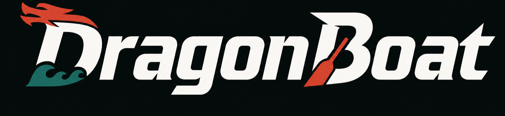

# DragonBoat

[中文说明](docs/README.zh-CN.md) | [English Guide](docs/README.en.md)

DragonBoat is a local-first coordination layer for coding-agent crews.

> One person should not have to row alone.

Instead of asking one flagship model to do every piece of work, DragonBoat lets one lead agent plan the work and make the final call while helper agents take bounded sub-tasks. The local browser deck shows who is working, what they said, and what proof they returned before you accept the result.



## 60-Second Quickstart

Start the local browser deck:

```bash
npm i -g dragonboat-crew
dragonboat deck --open
```

In a second terminal, move into the project where you want agents to work:

```bash
cd your-project
dragonboat steer --open
```

Paste this into the foreground Codex CLI:

```text
Read .dragonboat/skills/dragonboat-steerer.md and .dragonboat/crew-lessons.md.
Assess whether this task should use DragonBoat.
If it is crew-fit, draft a crew plan first and wait for my confirmation.
If I approve, create sealed task packets, start the rowers, monitor intent_confirmed/status/evidence, and summarize only reviewable results.
```

After that, the browser deck becomes a live control window for the run: the lead agent, helper agents, agent chat, and proof of done.

## What You Get

- **Lead + helper view**: see the main agent and the helper agents currently working on the task.
- **Agent chat and handoff log**: see questions, blockers, and progress messages between agents instead of reconstructing them from raw terminal logs.
- **Proof of done**: keep the commands, diffs, test results, and notes used to decide whether work is really ready.
- **Local run history**: every run stays in `.dragonboat/runs/<run_id>/` so you can inspect it, replay it, or delete it yourself.

<details>
<summary>More screenshots</summary>

Crew graph overview:


First-run onboarding when no session exists:


Agent chat, rower output, and proof queue:


Command deck structure overview:


</details>

## When To Use It

DragonBoat is a good fit when a task can be split safely:

- cross-layer changes where frontend, backend, and QA can move in parallel
- research or review tasks where different agents should challenge different assumptions
- migrations or audits that benefit from independent verification
- visual or browser-heavy work where one agent checks the UI while another checks code or contracts

Keep tiny UI tweaks, fuzzy product judgment, and live debugging with the foreground lead agent. DragonBoat is meant to make delegation explicit, not to turn every request into ceremony.

## Why It Matters

The strongest model should not have to carry the whole job alone. DragonBoat tries to make one expensive round of global reasoning reusable, then hands bounded work to cheaper or more specialized helpers. It also lets you measure whether a multi-agent run actually saved time or just added coordination cost.

## Quick Start And Guides

- [中文说明](docs/README.zh-CN.md)
- [English Guide](docs/README.en.md)
- [Vision](docs/vision.md)
- [Core concepts](docs/concepts.md)
- [Local web command deck](docs/local-web-command-deck.md)

## Release checks

```bash
dragonboat release check
dragonboat doctor
dragonboat doctor --deep --model kimi-k2.6 --effort max
dragonboat smoke run
dragonboat acceptance smoke --latest
dragonboat acceptance first-crew-loop --latest
```

Before publishing, read the [release checklist](docs/release-checklist.md).

## Security and privacy

DragonBoat keeps local run logs, messages, commands, and file paths on your machine. Review those artifacts before sharing them outside your team. See [Security and privacy](docs/security-and-privacy.md).
