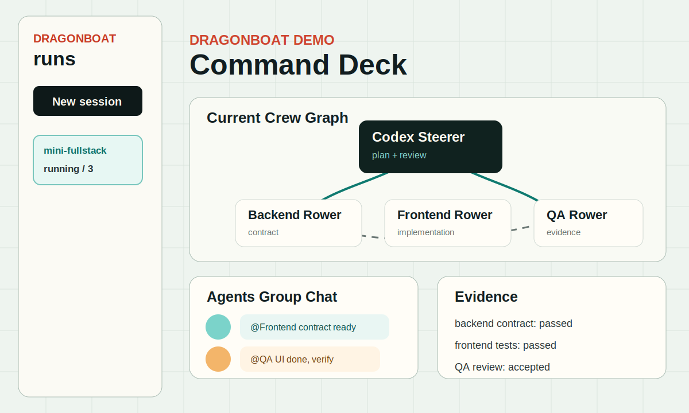

# Mini Fullstack Example

Use this when you want a compact cross-layer coding task with clear frontend, backend, and QA ownership.

## Prompt

See [task-prompt.md](task-prompt.md).

## Expected Crew Plan

See [expected-crew-plan.md](expected-crew-plan.md).

## Screenshot

## Replay

`event-replay.json` is a small synthetic ledger showing the expected shape of a run: steerer plan, backend contract, frontend implementation, QA evidence, and final acceptance.
