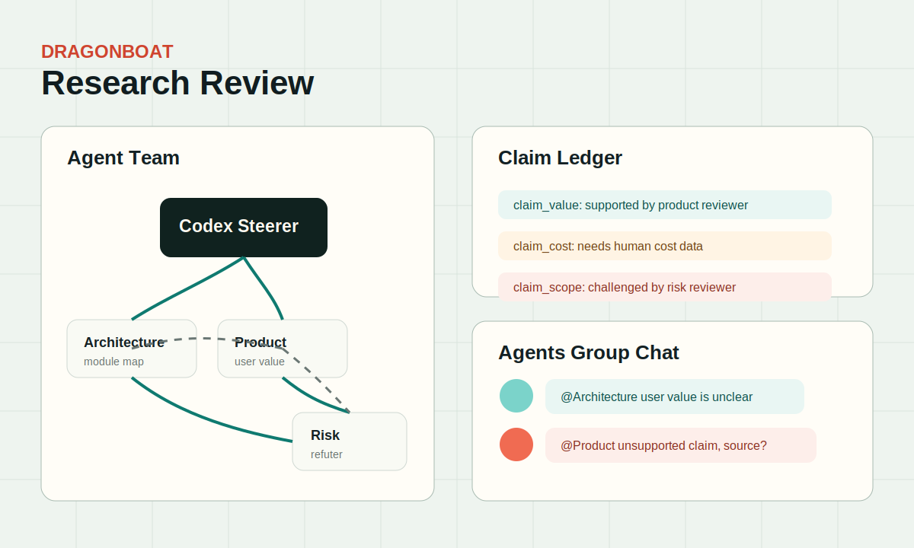

# Research Review Example

Use this when multiple agents should inspect the same topic from different viewpoints and challenge each other before the steerer writes a final review.

Start with [task-prompt.md](task-prompt.md) and compare the result with [expected-crew-plan.md](expected-crew-plan.md).

## Screenshot

## Replay

`event-replay.json` shows a compact claim-ledger review flow: independent claims, a peer challenge, and a steerer synthesis point.
