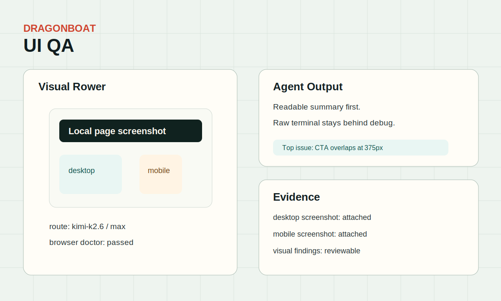

# UI QA Example

Use this when a visual or browser-heavy task needs screenshots, multimodal inspection, and a clear fallback if browser access is unhealthy.

Start with [task-prompt.md](task-prompt.md).

## Screenshot

## Replay

`event-replay.json` shows the expected browser-readiness check, visual-model route decision, and screenshot-backed evidence submission.
